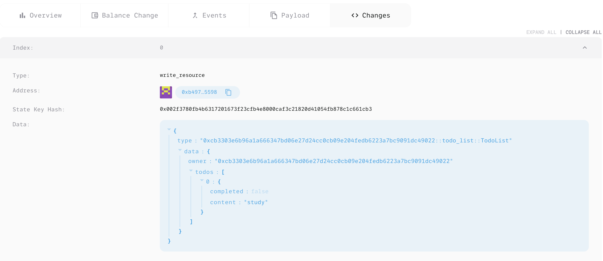
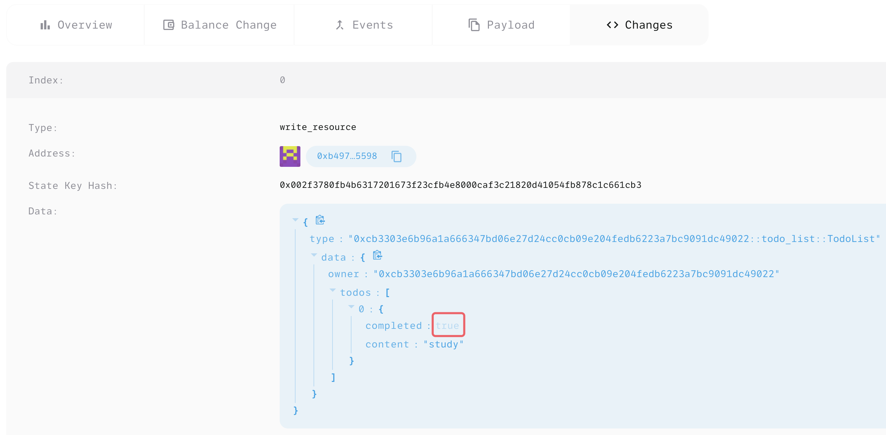

# 开发第一个Aptos Move合约：Todo list

## 工程创建

```bash
$ mkdir aptos_todo_list && cd aptos_todo_list

$ aptos move init --name  aptos_todo_list
{
  "Result": "Success"
}
```

## 合约开发

https://learn.aptoslabs.com/zh/code-examples/todo-list

## 环境初始化

```bash
$ aptos init
Configuring for profile default
Choose network from [devnet, testnet, mainnet, local, custom | defaults to devnet]
testnet
Enter your private key as a hex literal (0x...) [Current: None | No input: Generate new key (or keep one if present)]

No key given, generating key...
Account 0xcb3303e6b96a1a666347bd06e27d24cc0cb09e204fedb6223a7bc9091dc49022 doesn't exist, creating it and funding it with 100000000 Octas
Account 0xcb3303e6b96a1a666347bd06e27d24cc0cb09e204fedb6223a7bc9091dc49022 funded successfully

---
Aptos CLI is now set up for account 0xcb3303e6b96a1a666347bd06e27d24cc0cb09e204fedb6223a7bc9091dc49022 as profile default!
 See the account here: https://explorer.aptoslabs.com/account/0xcb3303e6b96a1a666347bd06e27d24cc0cb09e204fedb6223a7bc9091dc49022?network=testnet
 Run `aptos --help` for more information about commands
{
  "Result": "Success"
}
```

>   **注：生成的地址`0xcb3303e6b96a1a666347bd06e27d24cc0cb09e204fedb6223a7bc9091dc49022`就是账户地址，别名是`default`**

执行上述命令，将在当前工程目录生成以下文件：

```yaml
$ cat .aptos/config.yaml 
---
profiles:
  default:
    network: Testnet
    private_key: "0x2a88d0....0b45"
    public_key: "0xd6a31c....27ea6"
    account: cb3303e6b96a1a666347bd06e27d24cc0cb09e204fedb6223a7bc9091dc49022
    rest_url: "https://fullnode.testnet.aptoslabs.com"
    faucet_url: "https://faucet.testnet.aptoslabs.com"
```

## 领水

```bash
$ aptos account fund-with-faucet --account default
# 等价命令
$ aptos account fund-with-faucet --account 0xcb3303e6b96a1a666347bd06e27d24cc0cb09e204fedb6223a7bc9091dc49022

{
  "Result": "Added 100000000 Octas to account 0xcb3303e6b96a1a666347bd06e27d24cc0cb09e204fedb6223a7bc9091dc49022"
}
```

## 合约编译

```bash
$ aptos move build
# 等价命令
$ aptos move compile
Compiling, may take a little while to download git dependencies...
UPDATING GIT DEPENDENCY https://github.com/aptos-labs/aptos-core.git
INCLUDING DEPENDENCY AptosFramework
INCLUDING DEPENDENCY AptosStdlib
INCLUDING DEPENDENCY MoveStdlib
BUILDING aptos_todo_list
{
  "Result": [
    "cb3303e6b96a1a666347bd06e27d24cc0cb09e204fedb6223a7bc9091dc49022::todo_list"
  ]
}
```

>   注：如果Move.toml中未定义address，需使用命令：
>
>   ```bash
>   $ aptos move compile --named-addresses todo_list_addr=default
>   ```

## 执行单测

```bash
$ aptos move test
INCLUDING DEPENDENCY AptosFramework
INCLUDING DEPENDENCY AptosStdlib
INCLUDING DEPENDENCY MoveStdlib
BUILDING aptos_todo_list
Running Move unit tests
[debug] "todo_list_owner: @0x100"
[debug] "todo_list_length: 1"
[debug] "todo_content: \"New Todo\""
[debug] "todo_completed: false"
[debug] "todo_completed: true"
[ PASS    ] 0xcb3303e6b96a1a666347bd06e27d24cc0cb09e204fedb6223a7bc9091dc49022::todo_list::test_end_to_end
[ PASS    ] 0xcb3303e6b96a1a666347bd06e27d24cc0cb09e204fedb6223a7bc9091dc49022::todo_list::test_end_to_end_2_todo_lists
[ PASS    ] 0xcb3303e6b96a1a666347bd06e27d24cc0cb09e204fedb6223a7bc9091dc49022::todo_list::test_todo_already_completed
[ PASS    ] 0xcb3303e6b96a1a666347bd06e27d24cc0cb09e204fedb6223a7bc9091dc49022::todo_list::test_todo_does_not_exist
[ PASS    ] 0xcb3303e6b96a1a666347bd06e27d24cc0cb09e204fedb6223a7bc9091dc49022::todo_list::test_todo_list_does_not_exist
Test result: OK. Total tests: 5; passed: 5; failed: 0
{
  "Result": "Success"
}
```

## 合约部署

```bash
$ aptos move publish
Compiling, may take a little while to download git dependencies...
UPDATING GIT DEPENDENCY https://github.com/aptos-labs/aptos-core.git
INCLUDING DEPENDENCY AptosFramework
INCLUDING DEPENDENCY AptosStdlib
INCLUDING DEPENDENCY MoveStdlib
BUILDING aptos_todo_list
package size 4576 bytes

Do you want to submit a transaction for a range of [274000 - 411000] Octas at a gas unit price of 100 Octas? [yes/no] >
yes
Transaction submitted: https://explorer.aptoslabs.com/txn/0x0b7b5b75a81040352741c1342db44a57faea5b8492f2248bab54577b6fd146a3?network=testnet
{
  "Result": {
    "transaction_hash": "0x0b7b5b75a81040352741c1342db44a57faea5b8492f2248bab54577b6fd146a3",
    "gas_used": 2740,
    "gas_unit_price": 100,
    "sender": "cb3303e6b96a1a666347bd06e27d24cc0cb09e204fedb6223a7bc9091dc49022",
    "sequence_number": 0,
    "success": true,
    "timestamp_us": 1725804736732089,
    "version": 5954581859,
    "vm_status": "Executed successfully"
  }
}
```

## 合约调用

### create_todo_list

```bash
$ aptos move run \
  --function-id 'default::todo_list::create_todo_list' 
Do you want to submit a transaction for a range of [138600 - 207900] Octas at a gas unit price of 100 Octas? [yes/no] >
yes
Transaction submitted: https://explorer.aptoslabs.com/txn/0x4aad67f5976cb875e7aa4a10f6210fca79dbacaaccc004a3184eafe7b72a5fe2?network=testnet
{
  "Result": {
    "transaction_hash": "0x4aad67f5976cb875e7aa4a10f6210fca79dbacaaccc004a3184eafe7b72a5fe2",
    "gas_used": 1386,
    "gas_unit_price": 100,
    "sender": "cb3303e6b96a1a666347bd06e27d24cc0cb09e204fedb6223a7bc9091dc49022",
    "sequence_number": 3,
    "success": true,
    "timestamp_us": 1725807418268333,
    "version": 5954728316,
    "vm_status": "Executed successfully"
  }
}
```

### create_todo

```bash
$ aptos move run \
  --function-id 'default::todo_list::create_todo' \
  --args 'u64:0' 'string:study'
Do you want to submit a transaction for a range of [800 - 1200] Octas at a gas unit price of 100 Octas? [yes/no] >
yes
Transaction submitted: https://explorer.aptoslabs.com/txn/0x0559761e6e0e537832a7293a9afc02779a501534052a5ba1b8632c1804cbe6d3?network=testnet
{
  "Result": {
    "transaction_hash": "0x0559761e6e0e537832a7293a9afc02779a501534052a5ba1b8632c1804cbe6d3",
    "gas_used": 8,
    "gas_unit_price": 100,
    "sender": "cb3303e6b96a1a666347bd06e27d24cc0cb09e204fedb6223a7bc9091dc49022",
    "sequence_number": 4,
    "success": true,
    "timestamp_us": 1725807739852836,
    "version": 5954745955,
    "vm_status": "Executed successfully"
  }
}
```



### complete_todo

```bash
$ aptos move run \
  --function-id 'default::todo_list::complete_todo' \
  --args 'u64:0' 'u64:0'
Do you want to submit a transaction for a range of [600 - 900] Octas at a gas unit price of 100 Octas? [yes/no] >
yes
Transaction submitted: https://explorer.aptoslabs.com/txn/0x27bddde7703199720412a67854e4f04bac62c0213b1836f7bb289625ef93f503?network=testnet
{
  "Result": {
    "transaction_hash": "0x27bddde7703199720412a67854e4f04bac62c0213b1836f7bb289625ef93f503",
    "gas_used": 6,
    "gas_unit_price": 100,
    "sender": "cb3303e6b96a1a666347bd06e27d24cc0cb09e204fedb6223a7bc9091dc49022",
    "sequence_number": 5,
    "success": true,
    "timestamp_us": 1725807879910254,
    "version": 5954753634,
    "vm_status": "Executed successfully"
  }
}
```



## 学习材料

https://aptos.dev/en/build/guides/first-move-module
