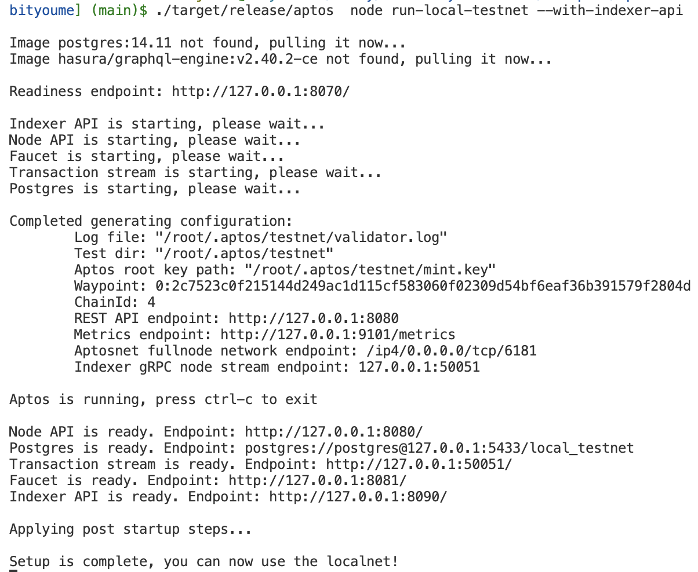
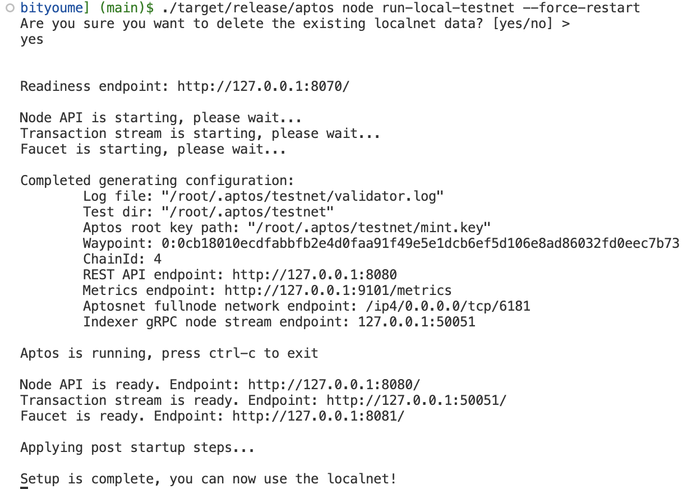
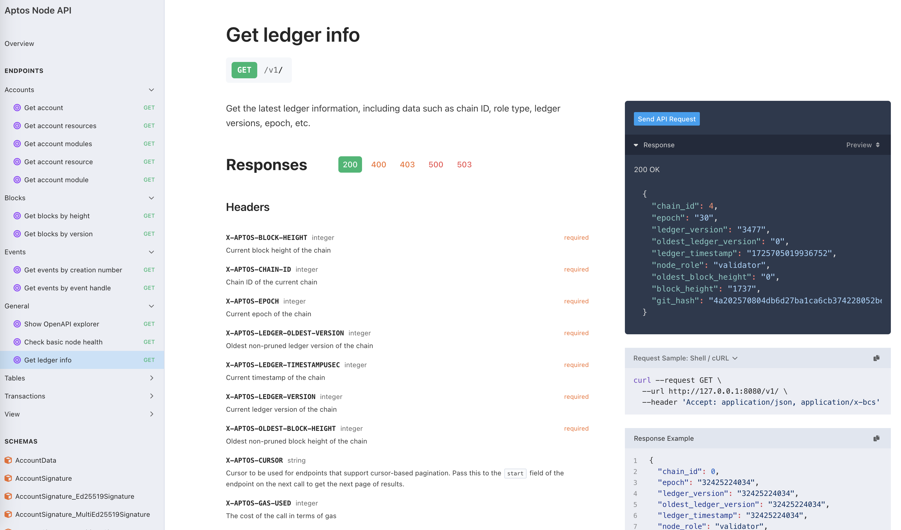

# 搭建本地测试网

## 学习材料

https://aptos.dev/zh/build/cli/running-a-local-network

## 下载及编译

```bash
# 下载源码
$ git@github.com:aptos-labs/aptos-core.git

# 安装依赖
$ ./dev_setup.sh  
  
# 编译
$ cargo build --release

# 查看版本
$ ./target/release/aptos -V
aptos 4.1.0
```

## 启动本地网络

```bash
$ ./target/release/aptos node run-local-testnet --with-indexer-api

Image postgres:14.11 not found, pulling it now...
Image hasura/graphql-engine:v2.40.2-ce not found, pulling it now...

Readiness endpoint: http://127.0.0.1:8070/

Indexer API is starting, please wait...
Node API is starting, please wait...
Faucet is starting, please wait...
Transaction stream is starting, please wait...
Postgres is starting, please wait...

Completed generating configuration:
        Log file: "/root/.aptos/testnet/validator.log"
        Test dir: "/root/.aptos/testnet"
        Aptos root key path: "/root/.aptos/testnet/mint.key"
        Waypoint: 0:2c7523c0f215144d249ac1d115cf583060f02309d54bf6eaf36b391579f2804d
        ChainId: 4
        REST API endpoint: http://127.0.0.1:8080
        Metrics endpoint: http://127.0.0.1:9101/metrics
        Aptosnet fullnode network endpoint: /ip4/0.0.0.0/tcp/6181
        Indexer gRPC node stream endpoint: 127.0.0.1:50051

Aptos is running, press ctrl-c to exit

Node API is ready. Endpoint: http://127.0.0.1:8080/
Postgres is ready. Endpoint: postgres://postgres@127.0.0.1:5433/local_testnet
Transaction stream is ready. Endpoint: http://127.0.0.1:50051/
Faucet is ready. Endpoint: http://127.0.0.1:8081/
Indexer API is ready. Endpoint: http://127.0.0.1:8090/

Applying post startup steps...

Setup is complete, you can now use the localnet!
```



## 运行服务

当本地网络启动成功后，将会启动以下服务：

| 服务           | 描述                                                         | 端点                                             |
| -------------- | ------------------------------------------------------------ | ------------------------------------------------ |
| **节点API**    | 直接在节点上运行的 REST API。它支持核心写功能，如交易提交，以及有限的读功能，如读取帐户资源或 Move 模块信息 | http://127.0.0.1:8080/                           |
| **索引器API**  | 提供对索引区块链数据丰富读取访问的 GraphQL API。通过点击 URL，可以访问 Hasura 控制台，一个帮助您查询索引器 GraphQL API 的 Web UI | http://127.0.0.1:8090/                           |
| **交易流服务** | 索引器 API 使用的 gRPC 交易流                                | http://127.0.0.1:50051/                          |
| **Postgres**   | 索引器处理器写入的数据库。索引器 API 从此数据库读取。        | postgres://postgres@127.0.0.1:5433/local_testnet |
| **水龙头**     | 可用于在本地网络中为帐户提供资金的服务                       | http://127.0.0.1:8081/                           |

## 重置本地网络

当需要将本地网络重置回初始状态时执行该命令，以应对：

-   对Move模块进行了不能向后兼容的更改
-   正在构建一个[自定义索引处理器](https://aptos.dev/zh/build/indexer/custom-processors)，希望使用一个全新的网络进行索引
-   想清除所有链上状态，例如账户、对象等

```bash
$ ./target/release/aptos node run-local-testnet --force-restart
Are you sure you want to delete the existing localnet data? [yes/no] >
yes

Readiness endpoint: http://127.0.0.1:8070/

Node API is starting, please wait...
Transaction stream is starting, please wait...
Faucet is starting, please wait...

Completed generating configuration:
        Log file: "/root/.aptos/testnet/validator.log"
        Test dir: "/root/.aptos/testnet"
        Aptos root key path: "/root/.aptos/testnet/mint.key"
        Waypoint: 0:0cb18010ecdfabbfb2e4d0faa91f49e5e1dcb6ef5d106e8ad86032fd0eec7b73
        ChainId: 4
        REST API endpoint: http://127.0.0.1:8080
        Metrics endpoint: http://127.0.0.1:9101/metrics
        Aptosnet fullnode network endpoint: /ip4/0.0.0.0/tcp/6181
        Indexer gRPC node stream endpoint: 127.0.0.1:50051

Aptos is running, press ctrl-c to exit

Node API is ready. Endpoint: http://127.0.0.1:8080/
Transaction stream is ready. Endpoint: http://127.0.0.1:50051/
Faucet is ready. Endpoint: http://127.0.0.1:8081/

Applying post startup steps...

Setup is complete, you can now use the localnet!
```



##  API文档

http://127.0.0.1:8080/v1/spec#/operations/get_ledger_info


